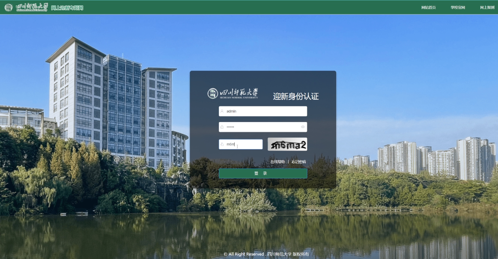
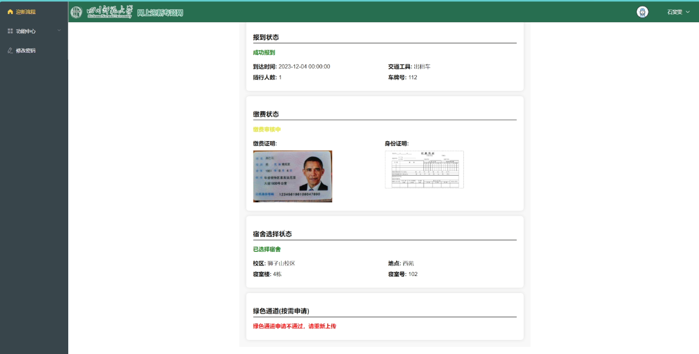
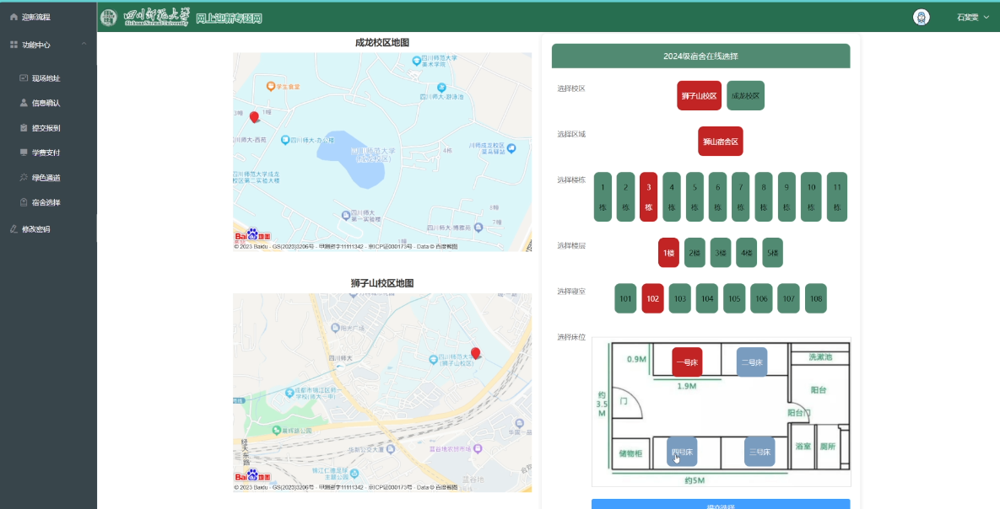
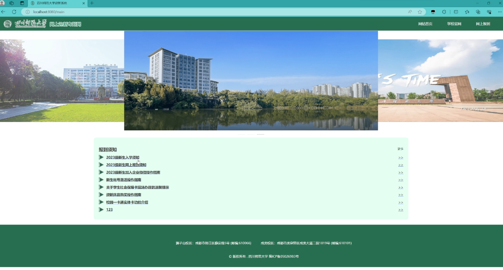
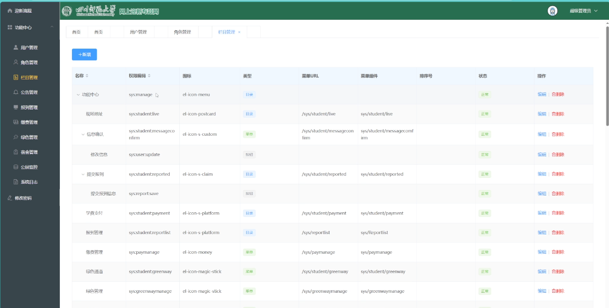
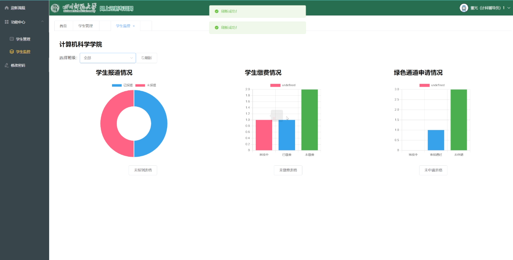

# 四川師範大学 新生オンボーディングシステム

[English](README.md) | [日本語](README.ja.md) | [简体中文](README.zh-CN.md)

四川師範大学の新入生受付業務を効率化する、入学手続き・進捗管理Webシステムです。

大学に入学した際、入学手続きが非常に煩雑で、必要な手続きを完了させるために学生が何度もあちこちへ足を運ばなければならないことに気づきました。
当時、ちょうどコンピュータ・ソフトウェア設計に関する講義を受けていたこともあり、私は学友と協力して、この問題を解決するためのプロジェクトに取り組むことにしました。

これは6名の小規模チームが4ヶ月かけて取り組んだコースプロジェクトです。
私はフロントエンドの設計と実装を担当し、他のメンバーはバックエンド開発、ドキュメント作成、要件分析などのタスクを分担しました。
## スクリーンショット

| ログイン | 学生の手続きフロー |
| --- | --- |
|  |  |

| 寮の選択 | お知らせ |
| --- | --- |
|  |  |

| 管理画面 | 統計 |
| --- | --- |
|  |  |

## 主な機能
学生、担当教員、入学担当者、管理者による多権限管理-RBAC
入学情報・お知らせの公開
学生区分別の手続きフロー管理
学部・各部門による共同処理
納付記録・グリーンチャネル管理
寮情報管理と寮選択
手続き進捗・統計の確認
Excel出力・アクセスログ監視
ユーザー・ロール・権限管理
CAPTCHA、JWT、メール認証

## 技術スタック

### フロントエンド

- Vue 3
- npm

### バックエンド

- Java 8
- Spring Boot 2.7.0
- Spring Security / JWT
- MyBatis-Plus 3.4.1
- MySQL
- Redis
- Swagger 2.9.2
- EasyExcel
- Maven

## リポジトリ構成

```text
.
├── assets/                         # 画面画像
├── 前端/vueadmin-vue/              # Git リンクとして登録されたフロントエンド
├── 后端/sys_newwelcome/            # Spring Boot バックエンド
└── 数据库SQL脚本/adsad2.sql         # データベース初期化スクリプト
```

> 現在の `main` ブランチでは、`前端/vueadmin-vue` が利用可能なサブモジュール URL のない Git リンクとして登録されています。クローン後にディレクトリが空の場合は、npm コマンドを実行する前にフロントエンドのソースを用意してください。

## セットアップ

### 必要な環境

- JDK 8
- Maven
- MySQL
- Redis
- フロントエンド用の Node.js と npm

### 1. データベースの初期化

MySQL データベースを作成し、次の SQL をインポートします。

```text
数据库SQL脚本/adsad2.sql
```

同梱のバックエンド設定では、`adsad2` というデータベース名が使用されています。起動前に、ローカル環境に合わせてデータベース、Redis、メール設定を確認してください。

### 2. バックエンドの起動

```bash
cd 后端/sys_newwelcome
mvn spring-boot:run
```

設定されているバックエンドのポートは `8081` です。

### 3. フロントエンドの起動

フロントエンドのソースを用意した後、次を実行します。

```bash
cd 前端/vueadmin-vue
npm install
npm run serve
```

本番用ビルド:

```bash
npm run build
```

## 注意事項

- リポジトリ内の設定ファイルはローカル開発向けです。デプロイ前に環境固有の値を確認し、必要に応じて変更してください。
- `assets/` 内の画像は既存システムの画面を示しています。
